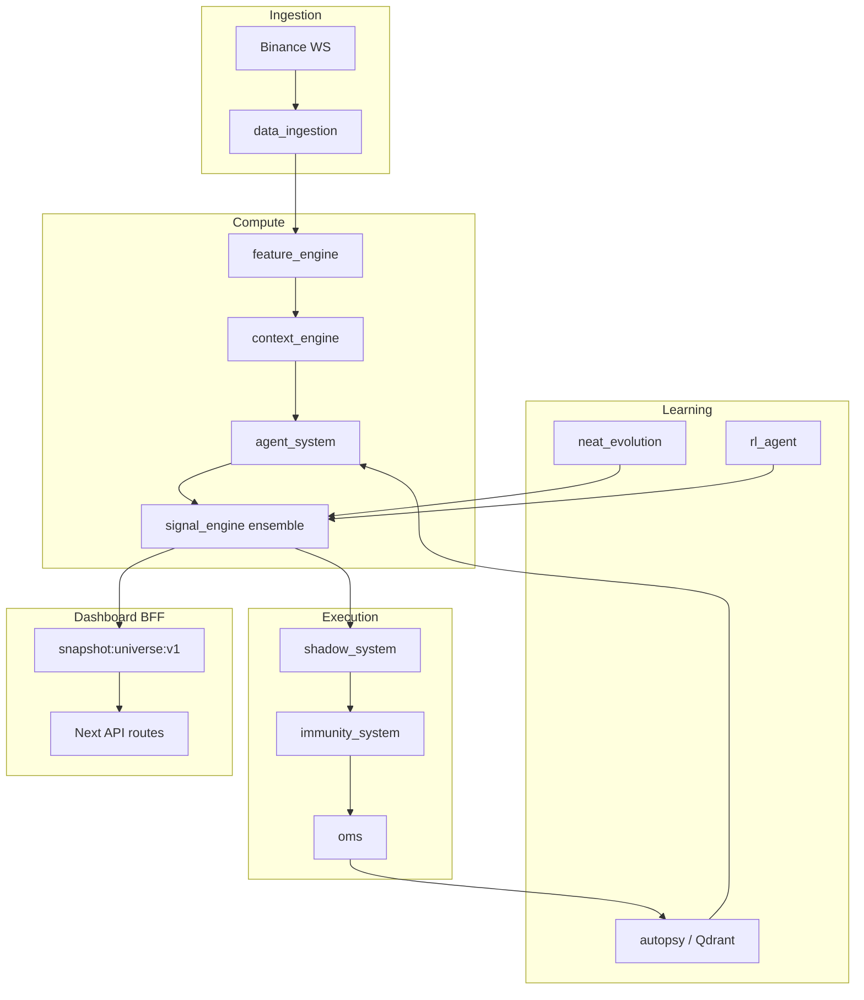

# Prometheus — Hedge-Fund Kalitesi Mimari Denetim ve Yol Haritası

Bu belge, sistemin **mevcut durumunu**, **11 dashboard modülünün** derin analizini ve **kurumsal AI trading ekosistemi** hedefine giden fazlandırılmış yol haritasını tanımlar.

---

## 1. Yönetici Özeti

**Prometheus**, Binance USDM Futures için çok servisli, container tabanlı bir algoritmik trading platformudur. Canlı veri yolu şu anda çalışır durumdadır:

```
Binance WS → data_ingestion → Redis → feature_engine → context_engine
    → agent_system (kural + opsiyonel LLM) → signal_engine → shadow_system / OMS (paper)
    → autopsy → Redis lessons + Qdrant
```

**Güçlü yanlar:** Modüler mikroservisler, immunity hard limitleri, shadow paper gate, çok sembol ölçekleme (500+), NEAT/RL/RAG iskeleti, dashboard gerçek zamanlı Redis okuması.

**Kritik boşluklar (hedefe göre):** Çoğunlukla poll-loop (tam event-driven değil), öğrenme kanalları (NEAT/RL/RAG) canlı sinyalle yeni birleştirildi, Timescale/Postgres kalıcı yazımı kısmi, canlı ccxt execution ve shadow promotion gate henüz OMS’i kilitlemiyor, backtest canlı agent pipeline’ından ayrı.

**Bu sprintte eklenen P0 bileşenleri:**

| Bileşen | Dosya | Etki |
|---------|-------|------|
| Ensemble fusion | `services/signal_engine/ensemble.py` | Agent + NEAT fitness + PPO RL tek confidence |
| Universe snapshot | `snapshot:universe:v1` | Dashboard O(1) sembol listesi |
| Timescale writer | `services/feature_engine/timescale_writer.py` | Feature geçmişi NEAT/RL/backtest için |
| SCAN not KEYS | `services/dashboard/src/lib/universe.ts` | 500 sembolde Redis blokajı önlenir |

---

## 2. Modül Modül Derin Analiz

### 2.1 Dashboard

| Boyut | Durum | Not |
|-------|-------|-----|
| Görev | Operasyonel C2: sistem sağlığı, sinyaller, risk, AI açıklamaları | Next.js 14, force-dynamic API |
| Veri akışı | Redis GET/pipeline; `snapshot:universe:v1` öncelikli | Eski: `KEYS features:latest:*` → P0’da SCAN/snapshot |
| Performans darboğazı | N×GET pipeline (500 sembol ~1–3s) | Sonraki: SSE/WebSocket push, sayfalı scanner |
| Öğrenme | Dolaylı — autopsy lessons UI’da | Kullanıcı davranışı öğrenimi yok |
| AI katkısı | Agent verdict, consensus_reasoning, targets | Claude dokümantasyonu; runtime çoğunlukla kural + Groq/Ollama |
| Gerçek zamanlı işlem | Yok — sadece izleme | Emir OMS’te |
| Hata toleransı | API boş array döner, crash fix’lendi | backtest normalizer |
| Ölçeklenebilirlik | Snapshot ile iyileşti | CDN/edge cache yok |
| UX | Kurumsal koyu tema, canlı ticker | TradingView seviyesi chart henüz yok |
| Cache | Redis kaynak; browser SWR yok | |
| Event-driven | Poll 5–15s sayfa refresh | P2: Redis pub/sub → SSE |
| Mikroservis | Uygun — ince BFF API katmanı | |

### 2.2 Positions

| Boyut | Durum |
|-------|-------|
| Görev | `oms:position:*` açık pozisyonlar |
| Veri | Redis SCAN `oms:position:*` |
| Risk | Immunity öncesi OMS paper |
| Gerçek zamanlı | Orta — OMS döngüsüne bağlı |
| Geliştirme | Korelasyon matrisi, portfolio heat, exposure balancing (P1) |

### 2.3 Scanner (SQS)

| Boyut | Durum |
|-------|-------|
| Görev | Signal Quality Score: confidence + backtest + shadow + regime + drift |
| Algoritma | `computeSQS()` — ağırlıklı skor 0–100 |
| Darboğaz | Tüm sembol pipeline (P0: discoverSymbols) |
| Öğrenme | Shadow leaderboard geri beslemesi |
| Geliştirme | Orderflow, liquidity sweep, fake breakout katmanları (P1 signal validator) |

### 2.4 Markets

| Boyut | Durum |
|-------|-------|
| Görev | Feature + signal özeti sembol başına |
| OB depth | `bid_qty_l1..l5`, imbalance_1/5/10/20 |
| Geliştirme | Volume profile, footprint, heatmap (P2 UI) |

### 2.5 Signals

| Boyut | Durum |
|-------|-------|
| Görev | `signal:latest:{symbol}` — yön, confidence, ensemble meta |
| Doğrulama | `SignalValidator` — crisis, drift, funding |
| Ensemble | Agent 55% + NEAT 25% + RL 20% (env) |
| Eşik | confidence < 0.60 → flat |
| Geliştirme | Probabilistic scoring, Monte Carlo edge (P1) |

### 2.6 Agents

| Boyut | Durum |
|-------|-------|
| Görev | 8 kural ajanı + debate; rotating batch 500 sembol |
| AI | `explanation_builder`, RAG lessons Redis |
| Inference | Groq/Ollama opsiyonel; Claude API doc-only |
| Darboğaz | LLM batch latency — concurrency env ile |
| Geliştirme | GPU quantized inference, continual learning (P2) |

### 2.7 Evolution (NEAT)

| Boyut | Durum |
|-------|-------|
| Görev | `neat_evolution` — genome fitness, Redis `neat:best_genome:*` |
| Öğrenme | Offline generational evolution |
| Canlı bağ | P0 ensemble fitness→direction proxy |
| Geliştirme | Meta-learning, auto param tuning, Postgres `rule_genomes` tam senkron (P1) |

### 2.8 Shadow

| Boyut | Durum |
|-------|-------|
| Görev | PaperTrader, ShadowEvaluator, PromotionEngine |
| Kriter | 100 trade, Sharpe≥1.5, WR≥52%, MDD<10% |
| Boşluk | `promotion_ready` OMS live’ı **gate etmiyor** |
| Geliştirme | Shadow vs real diff panel, AI confidence validation (P1) |

### 2.9 Risk

| Boyut | Durum |
|-------|-------|
| Görev | Immunity status, drift örnekleme, VIX, funding alerts |
| Hard limits | **IMMUTABLE** — max lev 3×, pos 5%, daily loss 2%, 3 open |
| Geliştirme | Dynamic VaR, correlation, black swan rules (P1 — immunity dışı katman) |

### 2.10 AI Memory

| Boyut | Durum |
|-------|-------|
| Görev | autopsy → Qdrant; `trade:lessons:{symbol}` Redis |
| RAG servisi | Embedder + QdrantManager — kısmen bağlı |
| Geliştirme | Semantic trade journal, başarı pattern clustering (P1) |

### 2.11 Backtest

| Boyut | Durum |
|-------|-------|
| Görev | Teknik backtest → `backtest:results` Redis |
| Boşluk | Agent debate pipeline ile **aynı değil** |
| Geliştirme | Tick replay, slippage/latency sim, parallel engine (P2) |

---

## 3. Dokuz Sütun — Hedef vs Mevcut

### 3.1 AI CORE

| Hedef | Mevcut | Sonraki adım |
|-------|--------|--------------|
| Multi-agent | 8+debate kural | Claude/Groq unified router |
| RL | PPO `rl:signal:*` | Ensemble’a bağlandı (P0) |
| NEAT | Per-symbol evolution | Fitness→ensemble (P0) |
| Continual learning | autopsy lessons | Online fine-tune buffer (rl_agent buffer var) |
| Regime | GMM context_engine | Manipülasyon/whale (on-chain genişletme) |
| GPU inference | Yok | Triton/ONNX sidecar |

### 3.2 PERFORMANCE

| Hedef | Mevcut | Sonraki |
|-------|--------|---------|
| Ultra low latency | Saniye级 poll | NATS/Kafka optional; tick coalescing |
| Vectorized | pandas/numpy feature | Numba/CuPy hot path |
| Redis events | `ch:trade_closed`, `ch:signal`, `ch:features` | Tam subscriber graph |
| WebSocket | data_ingestion combined stream | Dedicated OB L2 worker |

### 3.3 SIGNAL ENGINE

| Katman | Durum |
|--------|-------|
| Agent vote | Var |
| Technical fallback | Var |
| Ensemble NEAT+RL | **P0 eklendi** |
| Fake breakout / SMC / orderflow | Planlı P1 |

### 3.4 RISK ENGINE

Immunity sabit; dynamic sizing Kelly ile sınırlı. Portfolio heat ve AI stop → P1 `risk_engine` servisi (immunity’ye dokunmadan).

### 3.5 EVOLUTION

NEAT çalışıyor; başarısız genome RETIRED lifecycle RuleLifecycle ile Postgres’te — senkron güçlendirilmeli.

### 3.6 SHADOW

Paper path çalışıyor; promotion gate OMS’e wire edilmeli (P1).

### 3.7 AI MEMORY

Qdrant + lessons; embedding pipeline autopsy ile her trade’de tetiklenmeli (P1).

### 3.8 BACKTEST

Senaryo_engine ayrı; tick-level replay Timescale ticks’ten (P2).

### 3.9 DASHBOARD UX

Fonksiyonel kurumsal UI; TradingView chart, telemetry panels (P2).

---

## 4. Veri Akışı (Hedef Mimari)



---

## 5. Fazlandırılmış Yol Haritası

### P0 — Tamamlandı / devam eden (bu repo)

- [x] Ensemble: agent + NEAT + RL
- [x] `snapshot:universe:v1`
- [x] Timescale feature writer (async fire-and-forget)
- [x] Dashboard SCAN + snapshot discovery
- [ ] Tüm API route’larında KEYS kaldırma (memory, evolution, sqs — P0.1)

### P1 — 2–4 hafta

- [x] **`learning_engine`** — sürekli davranış öğrenme (2sn tarama + `ch:features` pub/sub)
- [x] Shadow `promotion_ready` → `system:promotion:status` → OMS live gate (`LIVE_TRADING_CONFIRMED` + `DRY_RUN=false`)
- [x] Postgres `trades` kalıcı yazım (OMS/shadow `trade_store.py`)
- Signal validator: liquidity sweep, funding spike, OB imbalance shock
- RAG: her kapanan trade embedding
- Risk overlay: correlation + portfolio heat (immunity üstü öneri katmanı)

### P2 — 1–3 ay

- Event-driven: NATS veya Redis Streams consumer groups
- Tick-level backtest + latency/slippage model
- GPU inference sidecar
- TradingView-grade chart + anomaly SSE

---

## 6. Ortam Değişkenleri (Yeni)

```env
ENSEMBLE_WEIGHT_AGENT=0.55
ENSEMBLE_WEIGHT_NEAT=0.25
ENSEMBLE_WEIGHT_RL=0.20
SIGNAL_MIN_CONFIDENCE=0.60
FEATURES_TIMESCALE_WRITE=true
```

---

## 7. Deploy

```bash
cd ~/binancebotrepo && git pull origin master
docker compose build signal_engine feature_engine dashboard
docker compose up -d signal_engine feature_engine dashboard
```

Servislerin ensemble ve snapshot üretmesi için `signal_engine` ve `feature_engine` yeniden başlatılmalıdır.

---

## 8. Başarı Metrikleri (KPI)

| Metrik | Hedef |
|--------|-------|
| Dashboard API p95 (500 sembol) | < 800ms snapshot hit |
| Signal cycle | < 10s tam evren |
| Shadow Sharpe before live | ≥ 1.5 |
| Ensemble disagreement rate | İzle — `ensemble.sources` |
| Timescale feature lag | < 60s |

---

*Belge sürümü: P0 ensemble + snapshot + Timescale writer entegrasyonu ile senkronize.*
